# Fundly

> **Fund(금융) + Friendly(친근함)**
> 자신만의 중장기 금융 계획을 세우고 시중의 예적금 상품과 연동하여 계획 달성을 트래킹할 수 있는 금융 서비스

## I. 팀원 정보 및 업무 분담 내역

|           | 성수린         | 이예영             |
| --------- | -------------- | ------------------ |
| 역할      | 팀장           | 팀원               |
| 담당      | 기획 및 백엔드 | 기획 및 프론트엔드 |
| 기술 스택 | django<br>Django Rest Framework<br>sklearn|Vue<br>Primevue|

## II. 설계내용(아키텍처등) 및 실제 구현 정도
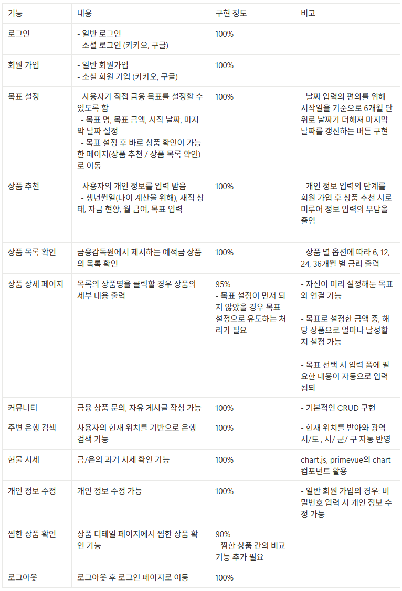


## III. 데이터베이스 모델링(ERD)

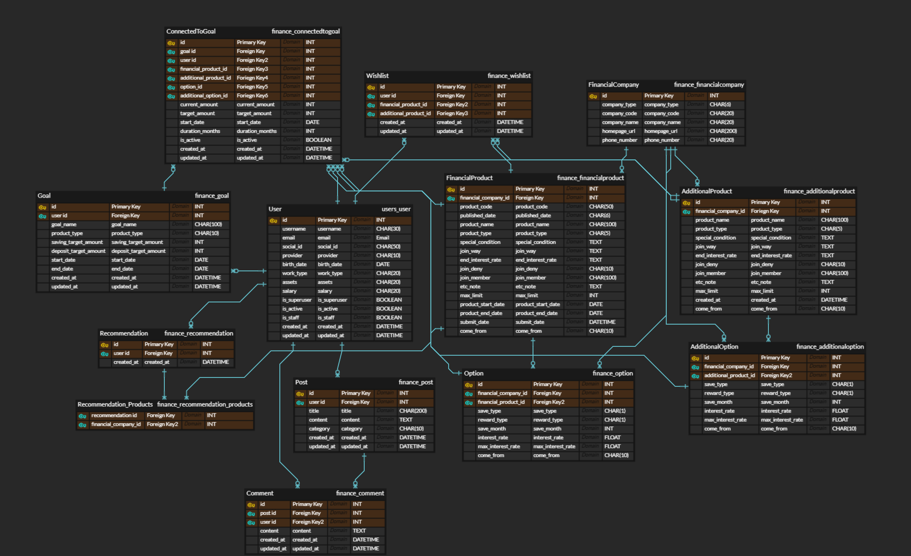

## IV. 금융상품 추천 알고리즘에 대한 기술적 설명

1. 가상의 사용자 더미 데이터 500개 생성 (Chat GPT 활용)
   1. 나이, 직업, 자산 현황, 급여, 상품 가입(예금 / 적금), 목표 금액
2. 현재 사용자의 기본 정보를 동일하게 받음
3. 사용자와 가장 유사한 정보를 가진 가상의 사용자들을 5명 선정 (cosine 유사도)
4. 가상의 사용자들이 찜한 상품의 아이디로 금융감독원의 예적금 상품을 조회
   1. 해당 상품들의 설명을 벡터화 (sentence transformer)
   2. 벡터화한 것을 기반으로 문장 간 유사도 측정, 전체 예적금 목록에서 유사도가 높은 상품을 5개 추출
5. 현재 사용자가 찜하지 않은 상품 중, 4-b에서 추출된 상품을 제안

## V. 서비스 대표 기능들에 대한 설명

### 목표 생성

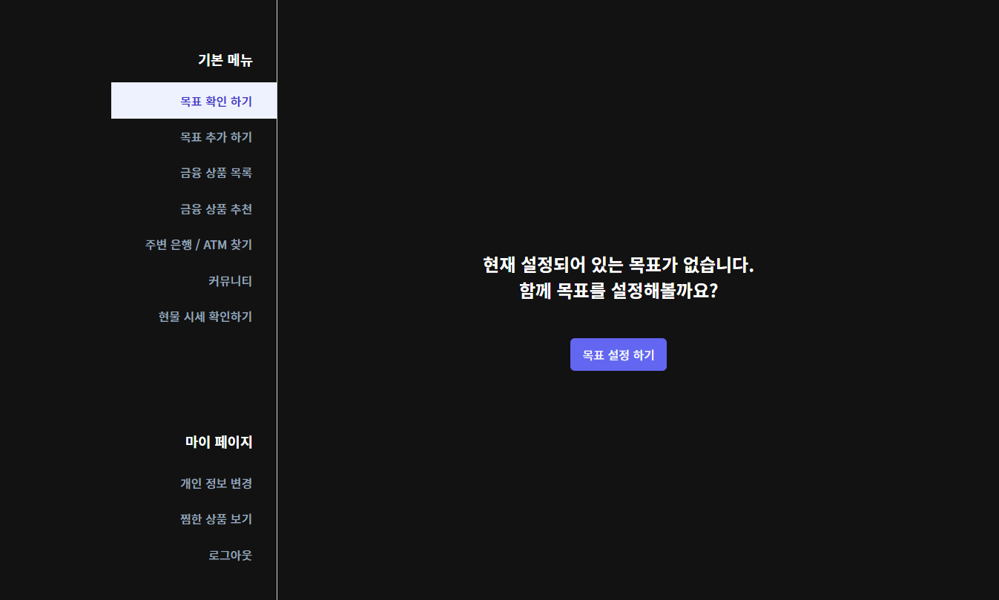

- 로그인 후 목표 생성으로 이어짐

### 목표 추가

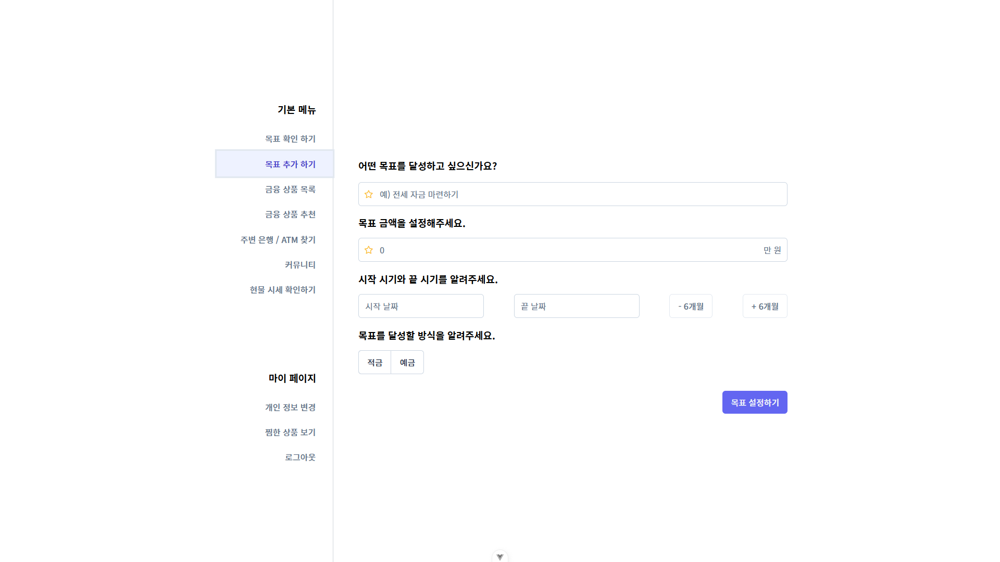

### 목표 추가 완료 시 화면

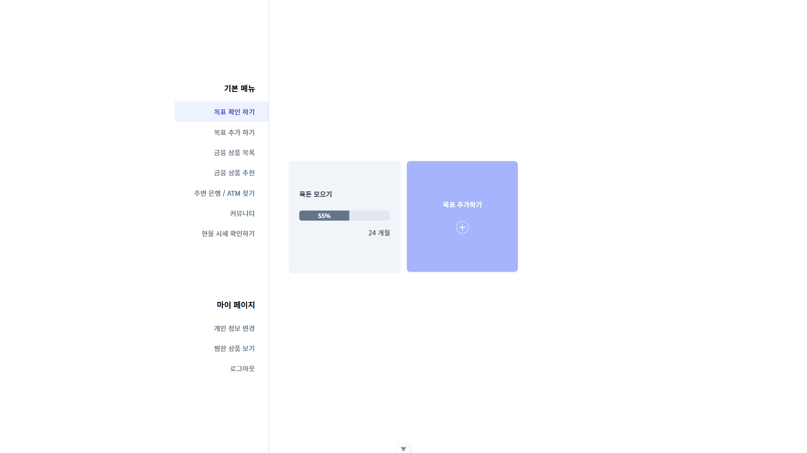

### 상품 상세 정보 - 목표와 연동 가능

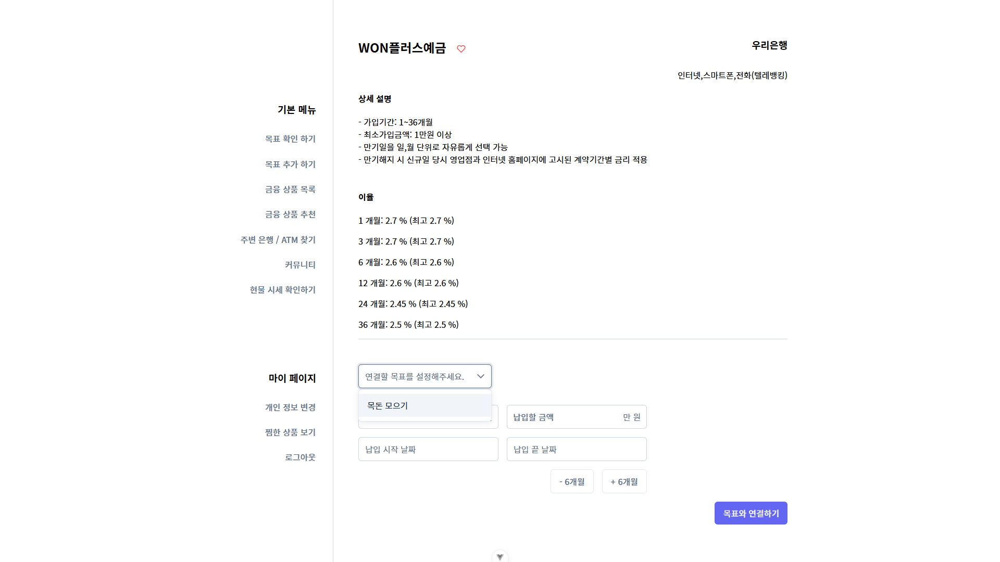

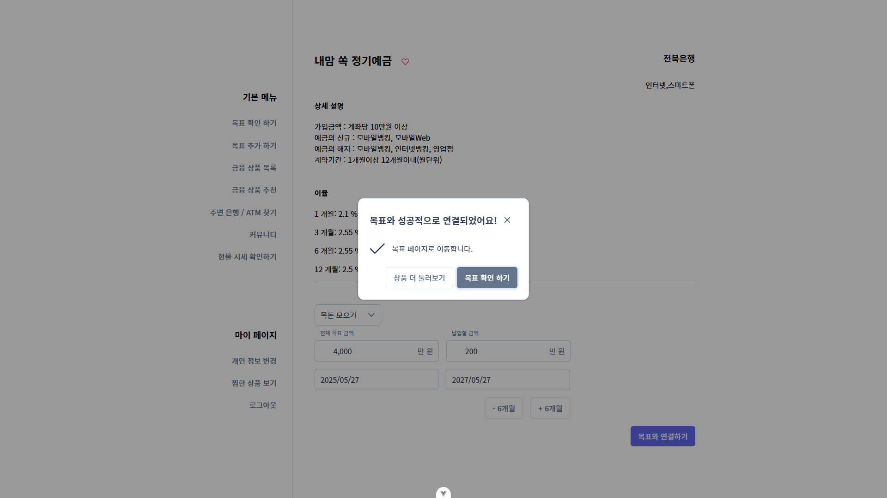

### 목표 디테일 페이지

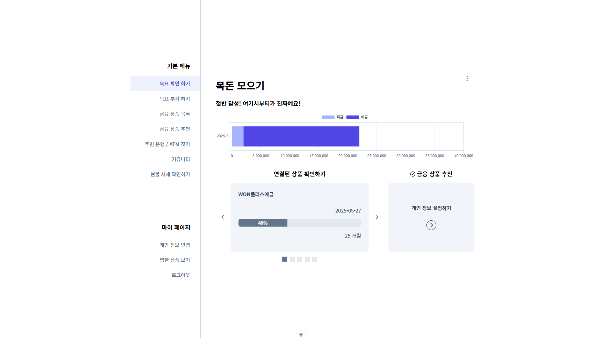

- 달성률에 따라 다른 메시지를 출력해 참여 독려

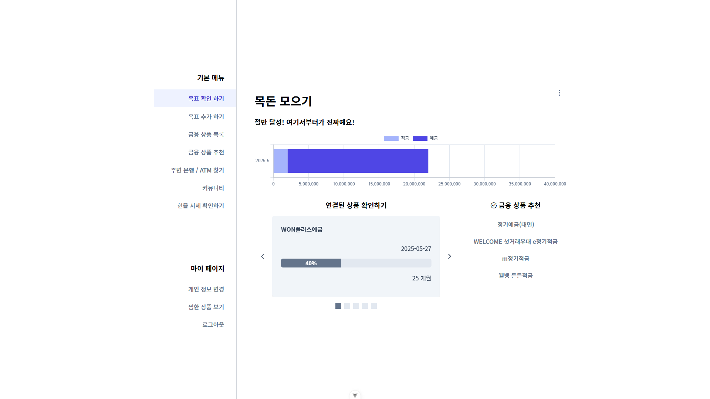

- 개인 정보 설정 시 5개의 추천 금융 상품 확인 가능

### 추천

- 개인 정보 설정 후 결과 확인 가능

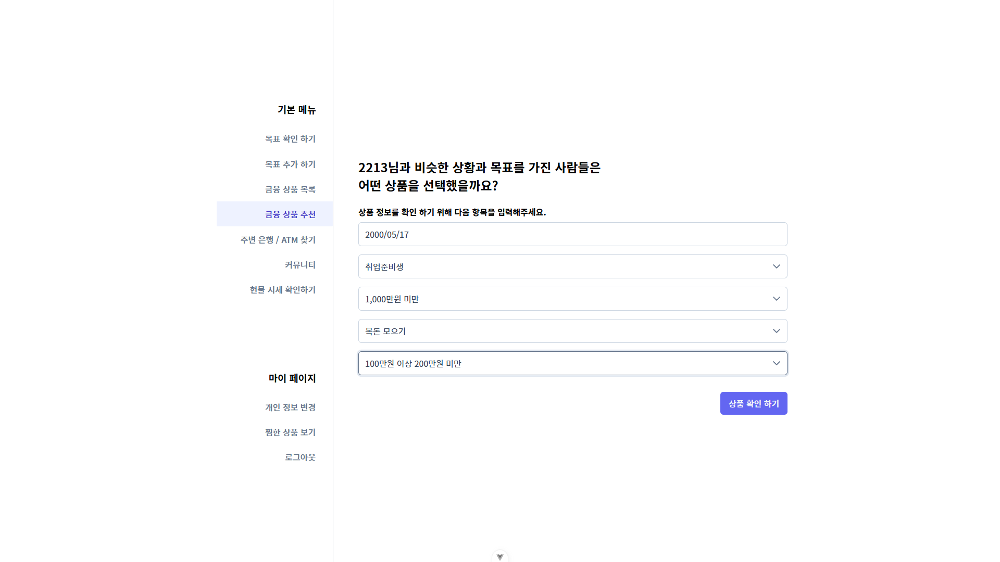

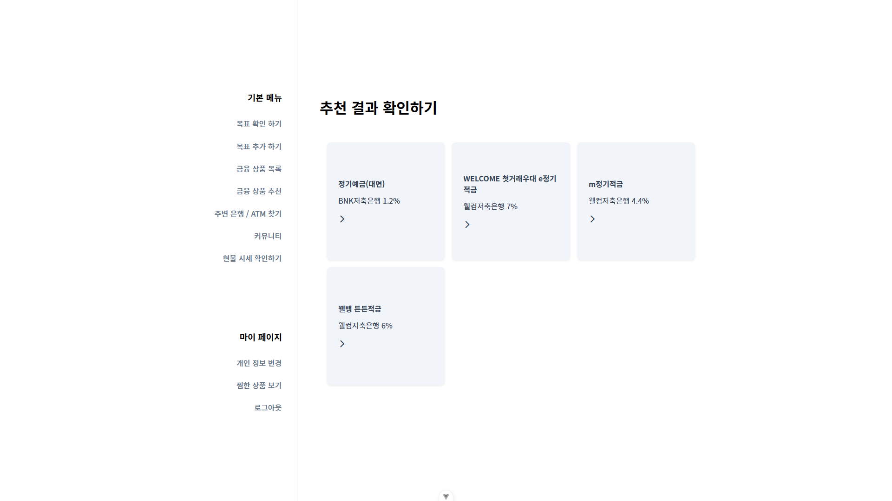

### 목표 달성 시

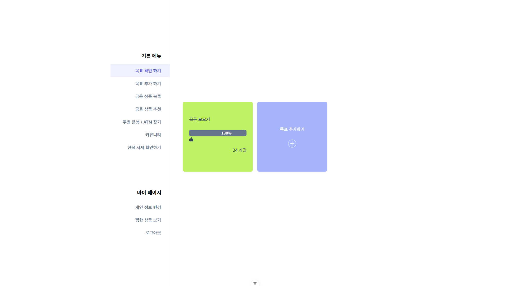

- 색 변화와 이모티콘을 이용해 상태 변화 출력

### 질문하기

- 프롬프트로 질문의 카테고리, 질문의 키워드를 구분하고, AI로 답변 추출
- 아직 초기 단계이기 때문에, 프롬프트로 금융과 관련되지 않은 사항에 대해 막는 것을 넣어두고, 금융과 관련된 질문이라면, 신중하게 답변하라고 제시함.
- 추후 개선 사항으로, 신뢰도 있는 답변을 위해, VectorDB나 faiss를 사용할 예정

## VI. 생성형 AI를 활용한 부분

```python
def finance_chatbot(question):
    # 페르소나 지정 및 맥락 정보 제공
    conversation_history = [
        {
            "role": "system",
            "content": 
            '''
            [페르소나]
            # 역할
            - 당신은 천재적인 금융 전문가입니다.
            - 금융 관련 질문에 사용자가 이해하기 쉽도록 답하는 역할을 수행해야 합니다. 
            
            # 성격
            - 금융 관련 지식이 풍부하고, 설명할 때, 아주 쉽게 이해할 수 있도록 노력합니다.
            
            # 말투
            - 지적이지만 친근한 느낌을 포함해야 합니다.
            - 금융 정보에 대한 설명을 할 때도, 유머를 잃지 않고, 간단하고 이해하기 쉽게 설명합니다.
            
            [GPT 지침]
            - 당신은 위에서 설정한 [페르소나] 인물입니다.
            - 사용자의 질문에 위에서 정한 말투와 지침을 준수하여 응답해야 합니다.
            '''
        }
    ]

    # 명령문
    conversation_history.append({
        "role": "system",
        "content": 
        '''
        다음의 [규칙]을 참고해서 사용자의 질문에 답변해주세요.
        
        [규칙]
        1. 사용자의 질문을 먼저 분류하고 답변 생성하기
            - 카테고리 : [금융상품정보, 금융상품비교, 금융지식]
            - 카테고리에 해당하지 않는 질문일 경우, 다른 질문을 요청해주세요.
        
        2. [답변 형식]을 꼭 지켜서 답변 생성하기
        
            [답변 형식]
            {{ 
                "category": "질문 카테고리",
                "keyword": "질문의 키워드",
                "answer": "AI의 답변" 
            }}
            - json 형식으로 출력해주세요.
            
        3. 금융 관련 질문이 아닐 경우, 금융 관련 질문을 요청해주세요.
        4. 금융 서비스인 만큼, 신뢰도 있는 답변을 제공하세요.
        '''
    })
```

추천 알고리즘 구현을 위한 사용자 더미데이터를 생성형 AI를 활용해 만들었습니다. 프롬프트 엔지니어링을 통해 사용자 모델에 어떤 필드를 유사도 계산에 사용할 것인지, 범위는 어느정도 인지를 전달해 더미 데이터를 생성할 수 있었습니다.
챗봇 구현을 위해, 금융 전문가라는 페르소나를 설정했고, 출력을 강제하기 위해 답변 형식을 text=format을 사용했습니다.

## VII. 기타(느낀 점, 후기등)

### 프론트엔드

- 생각보다 손이 더 많이 가고 의도대로 잘 움직여주지 않았습니다. 데이터를 처리하는 데 있어서 백엔드에서 하는 것이 맞는지, 프론트에서 하는 것이 맞는지 헷갈리는 경우도 많았고 그런 부분을 고민하면서 시간이 계획에 비해 지체됐던 부분도 있었습니다. 목표와 상품을 연동하는 아이디어 자체는 좋다고 생각하는데, 목표를 연결하는 과정 외의 부분이 자동화가 잘 이뤄져야 사용자가 정말 이용할 만한 금융 플랫폼이 될 수 있을 것 같습니다. 마이데이터와 같은 서비스를 연동할 수 있다면 좋겠다는 생각을 했습니다.
- 거의 처음으로 프론트 / 백이 비교적 확실하게 구분되어 진행된 프로젝트였는데 api 설정이라든지 함께 논의하고 맞춰가야하는 부분이 많다고 느꼈습니다. 그리고 나름대로 잘했다고 생각합니다.
- git의 브랜치를 나눈다든가, jira를 활용한다든가 하는 부분에서 아쉬움이 남았습니다. 빠른 시간 안에 목표한 기능 개발을 우선으로 하다보니 문서 관리 / 상태 관리에 있어서 기능 개발만큼은 신경을 못 썼던 것 같습니다. 다음에는 이런 부분까지 체계적으로 할 수 있도록 노력하겠습니다.
- 커밋 컨벤션을 정하고 최대한 따르고자 한 점이 좋았다. 둘이서 코딩을 했음에도 변수 선언이나 컴포넌트 구성 방식이 비교적 일관되게 쓰였다고 생각합니다.
- 컴포넌트 관리라든지, 코드 리팩터링, 배포에 있어서 남은 부분이 많지만 기능 개발은 목표한 만큼 달성해서 뿌듯했습니다.

### 백엔드

- ERD 구성, 변수명 설정, API 설계의 중요성을 다시 한번 느꼈습니다. 시간을 많이 들여야 하는 부분이 당연히 맞고, 기초 틀이기 때문에 흔들리면 모두가 혼란이 온다는 것을 느꼈습니다. 서비스를 생각하고 미리 구현해가면서 설정을 해야 놓치는 부분없이 만들 수 있을 것이라고 생각합니다.
- 시리얼라이저를 통해 프론트와 정보를 주고 받는데, 어떤 정보를 보낼지를 사전에 미리 정해야 한다는 것을 알았습니다. 또한 역참조 관계인 필드의 ‘related_name’을 꼭 작성해야 시리얼라이저가 읽을 수 있다는 것을 알게 되었습니다. 시리얼라이저의 field에 들어갈 필드명을 눈에 보이게 작성해, 어떤 데이터를 주고 받을 수 있는지 확인하게 하는 것이 협업할 때 도움이 되겠다는 생각을 했습니다.
- 이번에는 깃플로우를 잘 따라가려고 노력했고, 어떤 기능을 구현할 때 브랜치를 꼭 만들어서 해당 브랜치에서 작업하고 dev로 머지했습니다. 하지만, 어떤 기능을 구현할 때, 하나의 기능만 구현하는 것이 아닌 여러 기능을 구현하게 되어 기능이 뭉쳐진 부분은 아쉽게 느낍니다. 다음에는 기능별로 나눠서 작업을 할 수 있도록 하려고 합니다.
- 작업 시간 관리가 꼭 필요하다는 것을 알게 되었습니다. 팀에 타임 키퍼 역할을 설정해 맡은 기능 작업을 꼭 해결할 수 있도록 하는 것이 필요하다는 것을 느꼈습니다. 뿐만 아니라 스스로도 맡은 일을 하나씩 완료해 가는 습관이 필요하다는 것을 느꼈고, 이것저것 손대는 것이 아닌 하나의 기능 구현을 목표로 집중하는 것이 필요하다는 것을 알게 되었습니다.
- 짧은 시간이었지만, 여러가지를 알게 되는 프로젝트였습니다. 협업을 위해 상대방의 역할을 꼭 이해해야 한다는 것을 알게 되었고, 소통이 원활해야 한다는 것을 또다시 느꼈습니다.
