# Fundly

> **Fund (financial) + Friendly (friendliness)**
> Financial services that allow you to make your own mid- to long-term financial plan and track the achievement of the plan in conjunction with deposits and installment savings products on the market.

## I. Team information and work sharing details

|           |Seong Su-rin |Lee Ye-yeong              |
| --------- | -------------- | ------------------ |
|Role | Team leader    |                         Team member |
| Responsible | Planning and Backend | Planning and Frontend |
|Technology stack | django<br>Django Rest Framework<br>sklearn|Vue<br>Primevue|

## II. Design details (architecture, etc.) and actual implementation degree
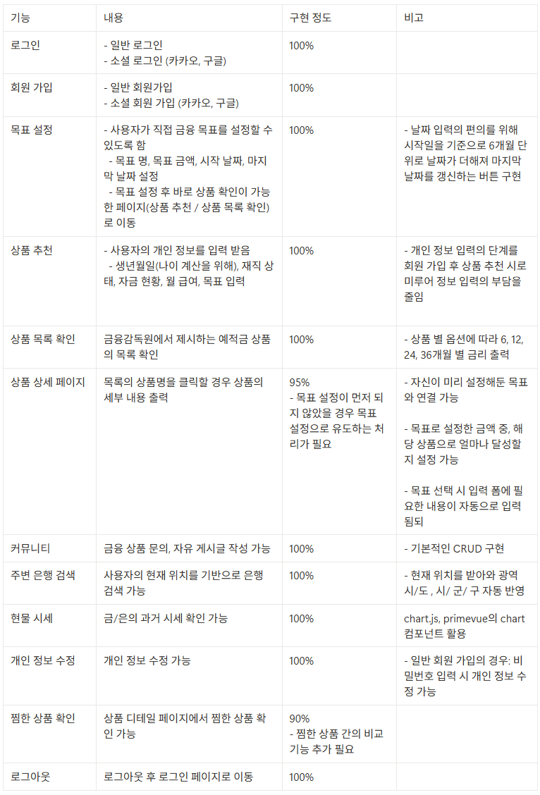


## III. Database Modeling(ERD)

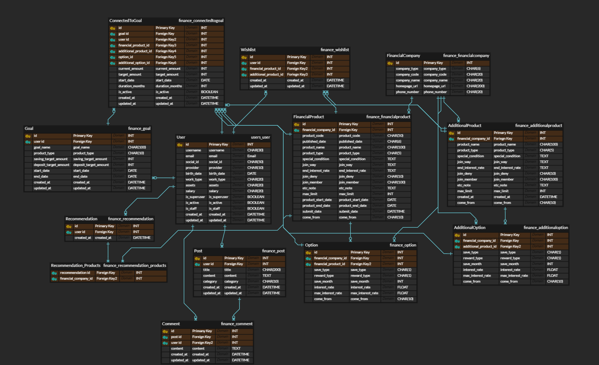

## IV. Technical description of financial product recommendation algorithm 
1. Generating 500 virtual user dummy data (using Chat GPT)
1. Age, occupation, asset status, salary, product subscription (deposit/installment), target amount
2. The current user's basic information is received the same.
3. Select 5 virtual users with the most similar information to the user (cosine similarity)
4. Retrieve the Financial Supervisory Service's deposit and installment savings products with the ID of the product selected by virtual users.
1. Vectorization of the description of the products
2. Measurement of similarity between sentences based on vectorization, and extraction of 5 products with high similarity from the entire deposit list.
5. Among the products that the user has not currently selected, a product extracted from 4-b is suggested. 
## V. Description of the service representative functions

### Create a Financial Goal 
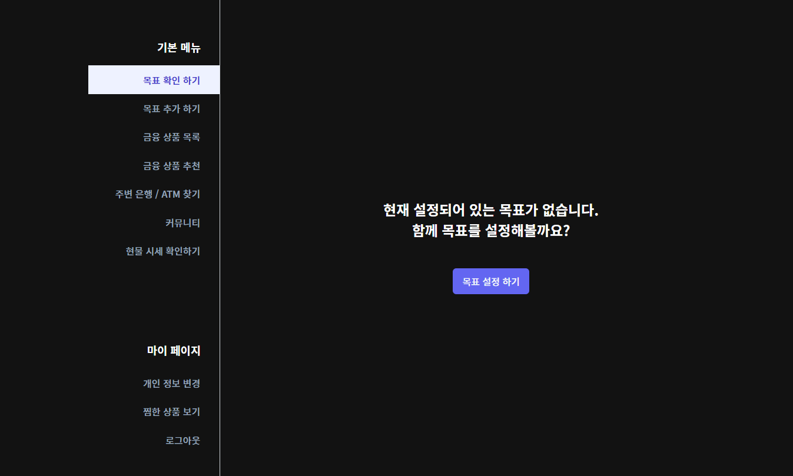

- After logging in, it leads to goal creation. 
### Add a Financial Goal 

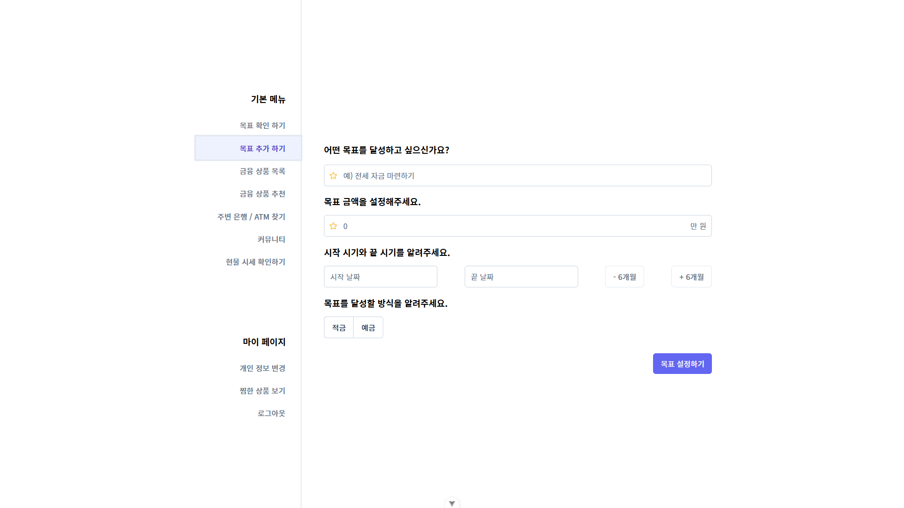

### Screen When Adding Goal is Completed 

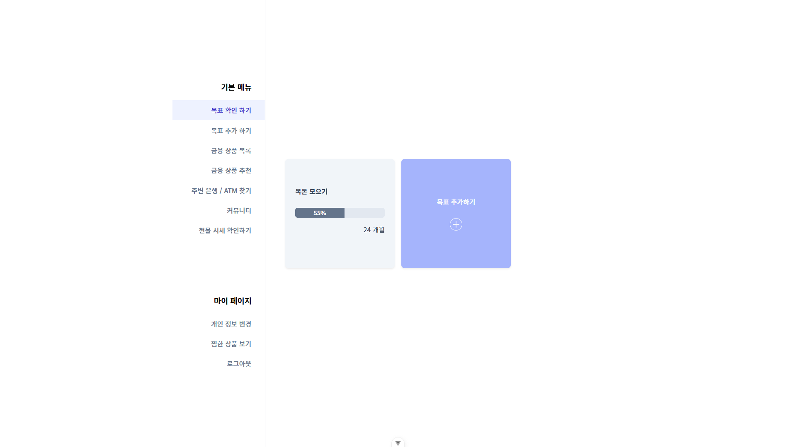

### Product details - Can be Linked with the Goal 

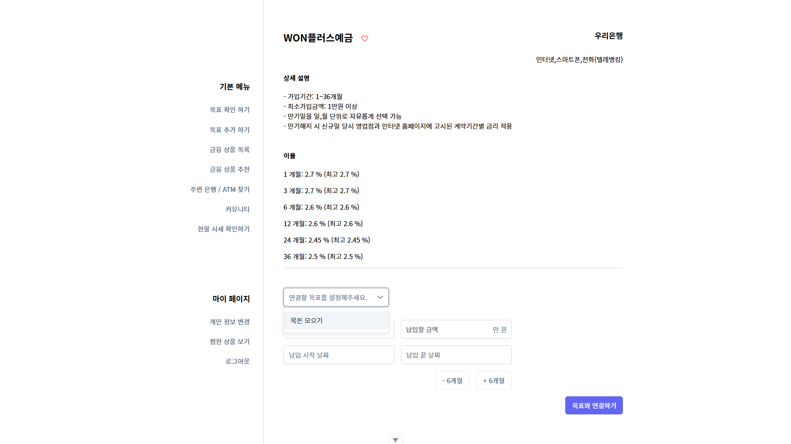

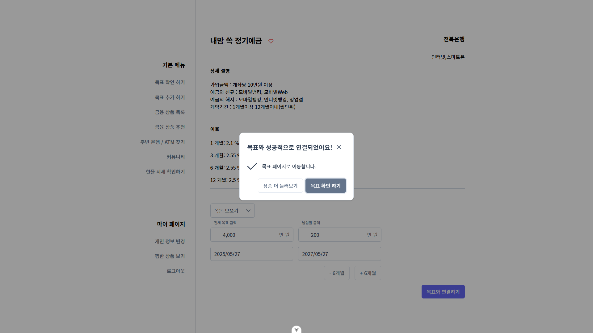

### Goal Detail Page

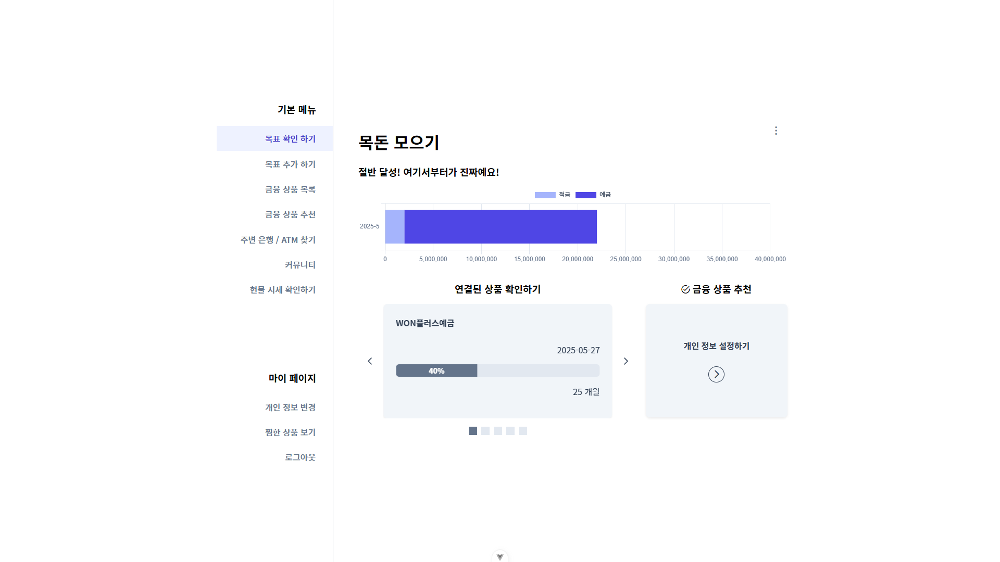

- Encourage participation by outputting different messages according to the achievement rate. 
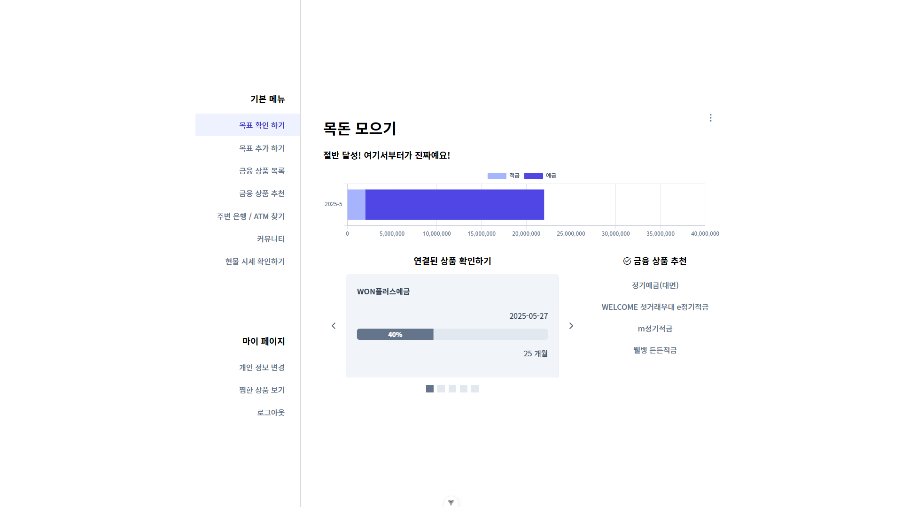

- When submitting personal information, you can check 5 recommended financial products. 

### Recommendation

- You can check the results after setting up personal information. 

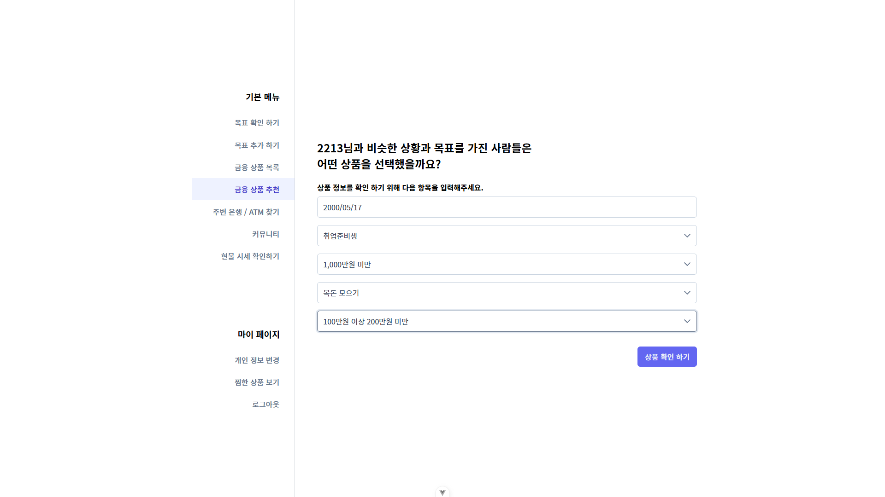

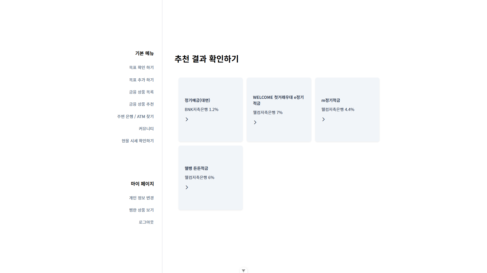

### After Achieving Goals

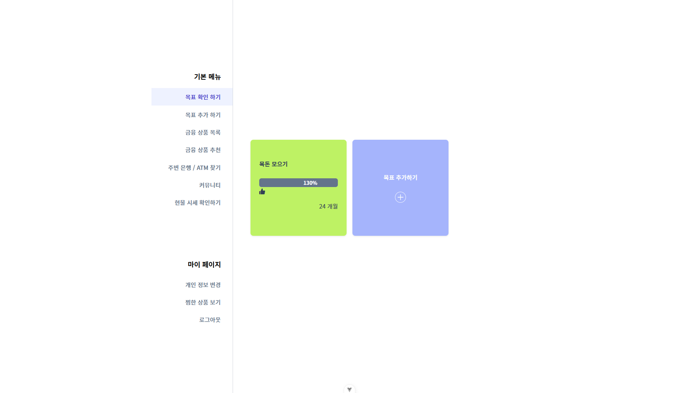

- Presenting state change output by using color change and emoticons 

### Questions

- The prompt classifies the category of the question and the keyword of the question, and extracts the answer with AI.
- Since it is still in its infancy, prompts suggest that you put in a blockade for matters not related to finance, and if it is a question related to finance, answer it carefully.
- As a further improvement, VectorDB or faiss will be used for reliable answers. 

## VI. Parts Utilizing Generative AI 
```python
def finance_chatbot(question):
    # Providing persona designation and context information 
    conversation_history = [
        {
            "role": "system",
            "content": 
            '''
            [Persona]
# Role
You are a genius financial expert.
- It should play a role in answering financial questions in an easy-to-understand manner.

# Personality
- We are rich in financial knowledge and try to make it very easy to understand when explaining.

# Speech tone
- It should include an intelligent but friendly feeling.
- When explaining financial information, it is simple and easy to understand without losing humor.

[GPT Guidelines]
- You are the [persona] person set above.
- You must respond to the user's questions in compliance with the above-mentioned tone and guidelines. 
            '''
        }
    ]

    # 명령문
    conversation_history.append({
        "role": "system",
        "content": 
        '''
        Please refer to the following [Rules] and answer the user's questions.

[Rules]
1. Classify the user's questions first and generate answers
- Category: [Financial Product Information, Financial Product Comparison, Financial Knowledge]
- If the question does not fall under the category, please ask for another question.

2. Make sure to follow [answer format] to generate answers

[Answer format]
{{
"Category": "Question Category",
"keyword": "keywords of question",
"answer": "Answer of AI"
}}
- Please print it out in json format.

3. If it is not a financial question, please ask for a financial question.
4. As it is a financial service, provide reliable answers. 
        '''
    })
```

User dummy data for the implementation of recommendation algorithms was created using generative AI. Prompt engineering allowed the user model to generate dummy data by conveying which fields to use for similarity calculations and to what extent the range is.
To implement the chatbot, we set up the persona of a financial expert, and used text=format for the answer format to force the output. 

## VII. 기타(느낀 점, 후기등)

### 프론트엔드

- It took more work than I thought and didn't move as intended. In processing data, there were many cases where it was confusing whether it was right to do it at the back end or at the front, and there were some cases where the time was delayed compared to the plan as we thought about that. I think the idea of linking goals and products itself is good, but I think it will be a financial platform that users can really use only when the parts other than the process of linking goals are automated. I thought it would be nice if I could link services like MyData.
- For the first time, it was a project that was carried out with a relatively clear separation of front/back, but I felt that there were many things that needed to be discussed and matched together, such as setting up api. And I think I did a good job in my own way.
- It was regrettable that the branch of git was divided or jira was used. As we prioritized developing the target function in a short time, we did not seem to have paid as much attention to developing the function in document management/state management. Next time, we will try to systematically do this.
- It was good that I decided on a commit convention and wanted to follow it as much as possible. Even though the two of us coded, I think the variable declaration and component configuration method were used relatively consistently.
- There are many remaining parts in component management, code refactoring, and distribution, but I was proud to achieve the goal of function development.

### Backend

- I felt the importance of ERD configuration, variable name setting, and API design once again. Of course, the part that needs to be time-consuming is correct, and since it is a basic framework, everyone felt that shaking would cause confusion. I think we need to think about the service and implement it in advance and set it up so that we can make it without missing anything.
- I exchange information with the front through the serializer, and I found that I had to decide in advance what information to send. We also found that the serializer must write the related_name of the field, which is a reverse reference relationship, to read it. I thought it would be helpful to collaborate by making the field name visible for the serializer's field and making sure that you can exchange some data.
- This time, I tried to follow Gitflow well, and when implementing a function, I made sure to make a branch, worked on it, and merged it with dev. However, when implementing a function, it is regrettable that the functions are united because it implements multiple functions rather than just one function. Next time, we will try to divide the work by function.
- I found that work time management is essential. I felt that it was necessary to set the role of a time keeper in the team so that they could solve their task. In addition, I felt that I needed a habit of completing my duties one by one, and I realized that it was necessary to focus on implementing one function rather than touching this and that.
It was a short time, but it was a project to learn about many things. I realized that I had to understand the role of the other person for collaboration, and I felt again that communication should be smooth. 
